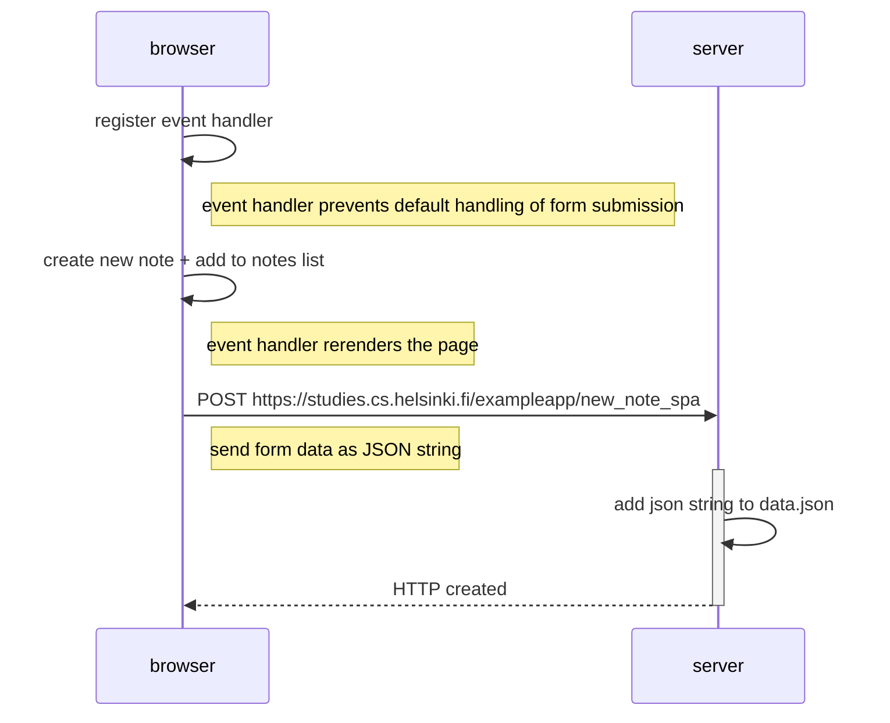

```mermaid
sequenceDiagram
    participant browser
    participant server
    
    browser->>browser: register event handler
    note right of browser: event handler prevents default handling of form submission
    browser->>browser: create new note + add to notes list
    note right of browser: event handler rerenders the page

    browser->>server: POST https://studies.cs.helsinki.fi/exampleapp/new_note_spa
    note right of browser: send form data as JSON string 
    activate server
    server->>server: add json string to data.json
    server-->>browser: HTTP created
    deactivate server

    
```